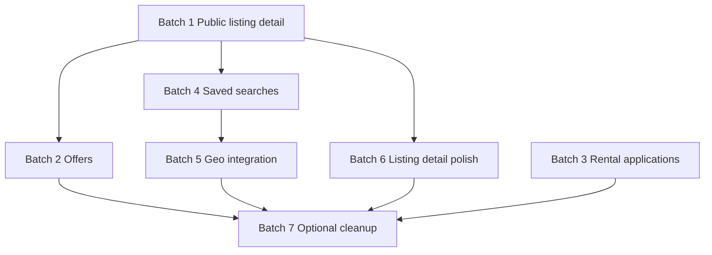

# Listings & Discovery Frontend Cleanup Plan

Companion to `LISTINGS_FRONTEND_MISMATCH_AUDIT.md`.

Goal: move the listings/discovery frontend from its current hybrid state to a backend-aligned implementation in low-risk, testable batches.

---

## Principles for the cleanup

1. **Fix contract mismatches before adding new features**
   - wrong payloads and wrong response assumptions are the biggest risk

2. **Refactor by domain slice, not by file type**
   - each batch should fully align one user flow end-to-end

3. **Preserve working admin/owner flows while modernizing public/tenant flows**
   - the operational listing detail page is ahead of the public listing page and should not be destabilized unnecessarily

4. **Prefer adapters at boundaries, not inconsistent field names throughout the UI**
   - the API layer should normalize as much as possible

5. **Keep changes reversible**
   - avoid giant rewrites in one pass
   - keep each batch small enough to validate independently

---

## Target end state

After cleanup, the frontend should have:

- one canonical listings domain model aligned with the API contract
- one canonical public listing detail implementation using real listing data only
- favorites/inquiries/offers/rental applications fully backend-driven
- saved searches that preserve full discovery queries including spatial modes
- geocoding routed through backend endpoints rather than direct third-party calls
- minimal or explicitly isolated mock mode behavior

---

## Recommended implementation order

### Batch 1 — Public listing detail hardening
**Why first:** smallest high-impact fix; removes the most obviously incorrect frontend behavior.

#### Goals
- remove fake listing fallback behavior
- replace localStorage-first favorites
- replace old inquiry payloads in public detail
- ensure public detail reads from the canonical listing type

#### Files to change
- `app/listings/[id]/page.tsx`
- `components/listing/ListingDetail.tsx`
- optionally reuse `components/common/FavoriteButton.tsx`
- optionally tighten `features/inquiries/services/inquiry.service.ts` use from UI

#### Concrete tasks
1. In `app/listings/[id]/page.tsx`
   - remove fake sample listing fallback
   - use `notFound()` when listing is absent
   - pass through real `Listing` data only

2. In `components/listing/ListingDetail.tsx`
   - replace inline favorite logic with query-backed favorite hooks or shared button component
   - replace direct inquiry axios call with `useSendInquiry()`
   - send `{ listingId, message, inquiryType, contactInfo? }`
   - remove legacy payload fields: `propertyId`, `tenantName`, `tenantEmail`

3. Normalize props
   - migrate component from ad hoc `ListingProp` to a shape derived from `features/listings/types/listing.types.ts`
   - remove assumptions like `blockchainHash` / `certificateId` unless populated by real API fields

#### Validation
- load public listing detail
- save/unsave favorite
- submit inquiry
- verify missing listing goes to not-found

#### Risk
- low to medium
- this is mostly isolated to public listing detail

---

### Batch 2 — Offer contract alignment
**Why second:** the service layer already exists; mostly a type + payload correction job.

#### Goals
- align offer status names
- align submit/respond payloads
- align response field names
- keep UI labels user-friendly while internal model matches backend

#### Files to change
- `features/offers/types/offer.types.ts`
- `features/offers/services/offer.service.ts`
- `features/offers/queries/offer.queries.ts`
- all offer UI consumers, likely including:
  - `components/listing/ListingDetail.tsx`
  - `app/(dashboard)/properties/[id]/page.tsx`
  - any offers pages under `app/(dashboard)/offers/*`

#### Concrete tasks
1. Update type model
   - status values: `submitted | accepted | rejected | countered | cancelled`
   - request payload: `amount`, `currency`, `message`, `expiresAt?`
   - respond payload: `action`, `counterAmount?`, `responseNote?`

2. Update service normalization
   - remove legacy `offerPrice` assumptions where possible
   - if temporary adapter needed, keep it only inside service layer

3. Update UI callers
   - replace `offerPrice` with `amount` at service boundary or use adapted request type consistently
   - replace response payloads from `{ status: ... }` to `{ action: ... }`

#### Validation
- submit offer on published sale listing
- counter / accept / reject offer in owner/admin view
- cancel offer in buyer view

#### Risk
- medium
- touches multiple surfaces but domain is contained

---

### Batch 3 — Rental applications schema refactor
**Why third:** highest complexity; better done after smaller wins.

#### Goals
- align rental application types with backend contract
- update application detail and review screens to nested response shape
- preserve role-based flows: tenant, landlord, admin

#### Files to change
- `features/rental-applications/types/rental-application.types.ts`
- `features/rental-applications/services/rental-application.service.ts`
- `features/rental-applications/queries/rental-application.queries.ts`
- `app/(dashboard)/applications/[id]/page.tsx`
- `app/(dashboard)/applications/page.tsx`
- `components/listing/RentalApplicationCard.tsx`

#### Concrete tasks
1. Replace current status model
   - from uppercase app-local statuses
   - to backend statuses:
     - `submitted`
     - `screening`
     - `approved`
     - `rejected`
     - `withdrawn`
     - `lease_created`

2. Replace flattened shape with contract-aligned nested fields
   - `screening.status/provider/reference/score/notes`
   - `appointment.status/scheduledFor/locationNote/note`
   - `lease`
   - `reviewedBy/reviewedAt/reviewNote`

3. Update UI rendering
   - stop reading fields like `screeningProvider`, `screeningScore`, `appointmentDate`
   - read from nested objects safely

4. Re-check payloads
   - review payload already close: `{ status, note }`
   - screening payload already close
   - appointment payload should support allowed statuses per role

#### Validation
- tenant submit application
- owner review to screening
- screening update
- appointment request/schedule
- approve/reject
- create lease
- withdraw when allowed

#### Risk
- high
- this is the largest contract correction in the listings-related scope

---

### Batch 4 — Saved searches completion
**Why fourth:** useful, moderately scoped, and depends on stabilized listings filter model.

#### Goals
- persist and restore complete search query state
- include spatial modes and `propertyType`
- keep `alertEnabled` first-class in UI

#### Files to change
- `features/listings/types/listing.types.ts`
- `features/saved-searches/types/saved-search.types.ts`
- `features/listings/services/listing.service.ts`
- `app/(dashboard)/properties/page.tsx`

#### Concrete tasks
1. Expand saved-search query type
   - include `propertyType`
   - include viewport fields
   - include radius fields
   - include polygon
   - include `verifiedOnly`, `availabilityStatus` if desired for parity

2. Update save payload creation
   - persist current active spatial mode exactly

3. Update apply logic
   - restore filters and map state together
   - restore `mapMode`, `mapCenter`, `mapRadius`, `mapPolygon` when appropriate

#### Validation
- save viewport search
- save radius search
- save polygon search
- reload/apply saved search and verify map/query update

#### Risk
- medium

---

### Batch 5 — Geo integration through backend
**Why fifth:** contract completeness and better production architecture.

#### Goals
- stop calling Nominatim directly from the browser
- use backend geo endpoints

#### Files to change
- `lib/api/endpoints.ts`
- `features/listings/services/listing.service.ts` or new geo service
- `app/(dashboard)/properties/create/page.tsx`
- any edit/create pages that do geocoding

#### Concrete tasks
1. Add endpoint constants
   - `/geo/geocode`
   - `/geo/reverse`

2. Add service wrappers
3. Replace direct `fetch('https://nominatim...')` calls
4. Normalize geo result shape in one place

#### Validation
- location search in create listing
- reverse lookup if implemented

#### Risk
- low to medium

---

### Batch 6 — Listing document + detail polish
**Why sixth:** follow-up correctness and UX quality.

#### Goals
- send selected document upload type
- improve title/verification UX
- reduce legacy image handling and lint issues in touched files

#### Files to change
- `app/(dashboard)/properties/[id]/page.tsx`
- `features/listings/services/listing.service.ts`

#### Concrete tasks
1. Use `docUploadType` in upload handler
2. Surface publish preconditions more explicitly
3. optionally replace raw `` usage with `next/image` where practical
4. fix touched lint issues in this file

#### Validation
- upload non-title document types
- title deed approval flow
- publish readiness UI

#### Risk
- low

---

### Batch 7 — Optional production cleanup
**Why last:** not required for core backend alignment.

#### Goals
- reduce hidden mock behavior
- normalize branding
- clean remaining listing-related lint issues

#### Files to review
- `features/favorites/services/favorite.service.ts`
- `config/site.config.ts`
- `metadata.json`
- `TESTING_GUIDE.md`
- touched route/layout files with lint failures

#### Tasks
1. Decide whether mock mode remains supported
2. If yes, isolate it clearly behind adapters
3. Normalize `VEX` / `Swafri` / `Swafir`
4. Update testing/docs to match actual map/provider behavior

---

## Dependency map

Notes:
- Batch 3 can run after Batch 1 or Batch 2, but should stay isolated because it has the highest change surface.
- Batch 4 and Batch 5 are related but can be split cleanly.

---

## Recommended first implementation batch

If the next step is code changes, start with **Batch 1**.

### Why Batch 1 first
- fixes obvious wrong behavior immediately
- removes fake public detail data
- replaces legacy localStorage usage in a user-facing page
- low blast radius

### Batch 1 success criteria
- public listing page only renders real backend listing data
- favorite button is backend-driven
- inquiry submission uses `listingId`
- no legacy `propertyId` payload remains on public listing detail

---

## What not to do

- do not rewrite all listings-related files in one batch
- do not mix offers and rental application refactors together
- do not remove all mock-mode code until the backend-aligned replacements are working
- do not rename everything globally without a service-layer migration plan

---

## Suggested execution checklist

### Step 3A
Implement Batch 1:
- public listing detail hardening

### Step 3B
Validate Batch 1 and fix any touched lint issues

### Step 3C
Implement Batch 2:
- offers alignment

### Step 3D
Implement Batch 3:
- rental applications refactor

---

## Immediate recommendation

Proceed next with:

**Batch 1 — Public listing detail hardening**

Target files:
- `app/listings/[id]/page.tsx`
- `components/listing/ListingDetail.tsx`
- possibly `components/common/FavoriteButton.tsx`
- possibly `features/inquiries/services/inquiry.service.ts`

That is the best low-risk first coding step.